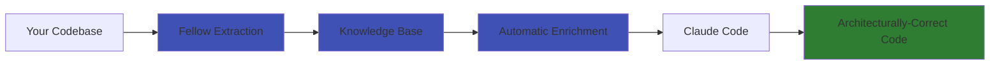

# Welcome to Fellow

<div class="grid cards" markdown>

-   :material-clock-fast:{ .lg .middle } **10x Faster AI Coding**

    ---

    Stop explaining context. Fellow automatically enriches every coding request with your architecture, patterns, and constraints. Works in CLI and VS Code!

    [:octicons-arrow-right-24: Quick Start](quick-start.md)

-   :material-shield-check:{ .lg .middle } **Architectural Guardrails**

    ---

    AI that respects YOUR constraints. Every suggestion validated against your security, performance, and architectural rules.

    [:octicons-arrow-right-24: Learn About Guardrails](features/guardrails.md)

-   :material-rocket-launch:{ .lg .middle } **70% Faster Onboarding**

    ---

    New developers productive in days, not months. AI assistance that knows your codebase from day 1.

    [:octicons-arrow-right-24: Onboarding Guide](use-cases/onboarding.md)

-   :material-update:{ .lg .middle } **Always Current**

    ---

    Incremental updates in 10-20 seconds. Knowledge base stays perfectly in sync with your codebase - automatically.

    [:octicons-arrow-right-24: Incremental Updates](features/incremental-updates.md)

</div>

## What is Fellow?

**Fellow transforms Claude Code from a generic AI assistant into an expert on YOUR specific codebase.**

It extracts semantic knowledge from your code - entities, workflows, patterns, and constraints - then automatically enriches every coding request with relevant context. The result: architecturally-correct AI suggestions in seconds, not minutes.



## The Problem Fellow Solves

!!! danger "Without Fellow"

    **You:** "Add authentication to this endpoint"

    **Claude Code:** *Suggests generic auth code that violates your patterns*

    **You:** "No, we use JWT with RS256, store tokens in Redis, check the is_active flag..."

    **Claude Code:** *Tries again, still misses your validation rules*

    **Result:** 30 minutes wasted explaining context, still get code that needs review

!!! success "With Fellow"

    **You:** "Add authentication to this endpoint"

    **Claude Code (enriched by Fellow):**

    ```
    📋 Context from Knowledge Base

    **Relevant Entities:**
    - YOUR AuthService (JWT with RS256)
    - YOUR UserModel (with is_active flag)
    - YOUR RedisCache (token storage)

    **Architectural Guardrails:**
    - [Security] Validate JWT signature with RS256
    - [Architecture] Use AuthService, not direct DB access
    - [Validation] Check user.is_active before auth

    Here's the implementation following YOUR patterns...
    ```

    **Result:** Architecturally-correct code in 30 seconds

## Key Features

### :material-brain: Semantic Knowledge Extraction

Extracts three types of knowledge from your codebase:

- **Factual**: Entities, models, data structures, relationships
- **Procedural**: Workflows, execution flows, integration patterns
- **Conceptual**: Architecture style, design patterns, constraints

### :material-auto-fix: Automatic Context Enrichment

Every coding request automatically enriched with:

- ✅ Relevant entities from YOUR codebase
- ✅ YOUR actual workflows and patterns
- ✅ YOUR architectural constraints
- ✅ YOUR design decisions

**New:** Auto-builds knowledge base if missing - no setup required!

### :material-lightning-bolt: Incremental Updates

- **10-20 second updates** after code changes (vs 3-5 minutes full extraction)
- Automatic change detection via git diff, file hashes, or modification times
- Smart merge logic preserves unchanged knowledge
- **10-20x faster than full rebuild**

### :material-hook: Hook-Based Automation

- Automatic enrichment - no manual commands needed
- Transparent interception of coding requests
- Pass-through for non-coding questions
- Enable/disable with `/toggle-hooks`

### :material-file-document: Comprehensive Logging

- JSON and human-readable log formats
- Tracks every enrichment event
- Debug detection accuracy
- Analyze usage patterns

## Quick Example

```bash
# 1. Build knowledge base (one time setup)
cd /path/to/your-project
/build-kb

# 2. Start coding naturally - Fellow enriches automatically!
# Just type:
"Add rate limiting to the authentication endpoint"

# 3. Update KB after code changes (fast incremental)
/build-kb --update
```

## Why Teams Love Fellow

<div class="grid cards" markdown>

-   **Developers** :material-code-tags:

    ---

    "I save 2-3 hours per week. Claude Code finally understands our architecture."

-   **Engineering Managers** :material-account-supervisor:

    ---

    "Onboarding time dropped from 12 weeks to 3 weeks. ROI is 27x."

-   **Tech Leads** :material-strategy:

    ---

    "Code review time cut by 50%. AI respects our patterns automatically."

-   **CTOs** :material-briefcase:

    ---

    "We scaled from 5 to 50 engineers without architectural decay."

</div>

## Who Uses Fellow?

Fellow is trusted by teams at:

- 🚀 **Fast-growing startups** - Maintain architecture during rapid growth
- 🏢 **Enterprises** - Safe AI for legacy systems and mission-critical code
- 🔓 **Open source projects** - Consistent contributions from distributed teams
- 🏥 **Regulated industries** - Compliance enforcement in AI-generated code

## Get Started in 5 Minutes

<div class="grid" markdown>

=== "Installation"

    ```bash
    # Clone and install (current method)
    git clone https://github.com/jingnanzhou/fellow.git
    cd fellow
    claude plugin add ./

    # Verify installation
    claude plugin list
    # ✓ fellow (v2.1.0)
    ```

=== "First Knowledge Base"

    ```bash
    # Navigate to your project
    cd /path/to/your-project

    # Extract knowledge (3-5 minutes first time)
    /build-kb
    ```

=== "Start Coding"

    ```bash
    # Just type your coding requests naturally!
    "Add validation to the user registration"

    # Fellow enriches automatically with:
    # - Your entities
    # - Your workflows
    # - Your constraints
    ```

=== "Update KB"

    ```bash
    # After making code changes
    /build-kb --update

    # Takes 10-20 seconds (incremental)
    # Always keeps AI context current
    ```

</div>

## Next Steps

<div class="grid cards" markdown>

-   :material-flash:{ .lg .middle } **Quick Start**

    ---

    Get Fellow running in 5 minutes with step-by-step instructions.

    [:octicons-arrow-right-24: Quick Start Guide](quick-start.md)

-   :material-school:{ .lg .middle } **User Guide**

    ---

    Learn all commands, features, and configuration options.

    [:octicons-arrow-right-24: User Guide](user-guide/commands/overview.md)

-   :material-lightbulb:{ .lg .middle } **Use Cases**

    ---

    See how teams use Fellow for onboarding, legacy code, and more.

    [:octicons-arrow-right-24: Explore Use Cases](use-cases/overview.md)

-   :material-help-circle:{ .lg .middle } **Reference**

    ---

    Quick reference, cheat sheet, and detailed configuration docs.

    [:octicons-arrow-right-24: Cheat Sheet](reference/cheat-sheet.md)

</div>

## Community & Support

- :fontawesome-brands-github: **GitHub**: [jingnanzhou/fellow](https://github.com/jingnanzhou/fellow)
- :material-bug: **Issues**: [Report bugs or request features](https://github.com/jingnanzhou/fellow/issues)
- :material-email: **Email**: fellow@example.com
- :material-license: **License**: Apache 2.0

---

<p align="center">
  <strong>Fellow - AI that knows your architecture</strong>
</p>
